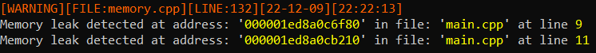

# Playground
An easy way to get a fast project setup for gui apps.

## Dependencies
- stb
- glfw
- glad
- glm

## Supported platform
- [x] windows
- [ ] Linux(not tested yet)
- [ ] Apple/IOS(not tested yet)
## Features
- [ ] 2D graphics(not finished)
- [ ] Graphical user interface
- [x] Sprite sheet builder
- [x] Console logging system
- [x] Filestream system
- [ ] File logging system
- [x] File hot loading
- [ ] SXF 
- [x] Memory leak tracking
- [x] User input system
- [ ] Unit text system

## Build instructions

The getVendor.bat/sh should be executed before!

### cmake
```cmake
cmake_minimum_required(VERSION 3.20)
project(ExampleProject)
set(CMAKE_CXX_STANDARD 20)

include_directories(vendor/Playground/PlaygroundLib/hdr)
add_subdirectory(vendor/Playground/PlaygroundLib)

add_executable(ExampleProject main.cpp)
target_link_libraries(ExampleProject PlaygroundLib)
```

## Examples

### Logging system
````cpp
#include "core.h"
#include "logger.h"

int main(int argc, char** argv)
{
    CoreInit();
    LOG_INFO({C_HiLi("highlight", Yellow)}, "info log -> highlight <- %s", "logger")
    LOG_WARNING({C_HiLi("highlight", Blue)}, "warning log -> highlight <- %s", "logger")
    LOG_ERROR({C_HiLi("highlight", Purple)}, "error log -> highlight <- %s", "logger")
    LOG_ASSERT(true, {C_HiLi("highlight", Orange)}, "assert log -> highlight <- %s", "logger")
    return EXIT_SUCCESS;
}
````
The output:


### Hot loading system
````c++
#include "core.h"
#include "util/hotloader.h"

int main(int argc, char** argv)
{
    CoreInit();
    HotLoader::AddFileToWatch("../Sandbox/main.cpp");
    while(!HotLoader::IsModified("../Sandbox/main.cpp"))
    {
        HotLoader::CheckFiles();
    }
    auto file = HotLoader::GetFile("../Sandbox/main.cpp");
    HotLoader::RemoveFileToWatch("../Sandbox/main.cpp");
    return EXIT_SUCCESS;
}
````
The output when a change is detected:


### Memory leak detection
```c++
#include "core.h"
#include "util/memory.h"

int main(int argc, char** argv)
{
CoreInit();
MemoryEnableTracking(true);
int* array1 = (int*)Malloc(8);
int* array2 = (int*)Malloc(8);              //memory leak is never freed
int* array3 = (int*)MemReg(new int[1]);
int* array4 = (int*)MemReg(new int[1]);     //memory leak is never freed

MemZero(array1, 8);
MemZero(array2, 8);
MemZero(array3, 8);
MemZero(array4, 8);

MemDeReg(array3);
Free(array1);
return EXIT_SUCCESS;
}
```
The output:



### Building a window
```c++
#include "core.h"
#include "window/window.h"

int main(int argc, char** argv)
{
    CoreInit();
    Window::Init();
    Window::Window win = Window::WindowBuilder
            .setSize(400, 300)
            .setRGBBufferSize(8, 8, 8)
            .setOpacity(1.0f)
            .setRefreshRate(60)
            .centerWindowOnScreen()
            .setStandardCursor(Window::CrosshairCursor)
            .setSettingsFileName("window.node")
            .build("playground");
    win.init();

    while(win.isWindowValid())
    {
        win.swapBuffers();
        Window::pollEvents();
    }
    return EXIT_SUCCESS;
}
```

The result:


For more examples take a look in the docs